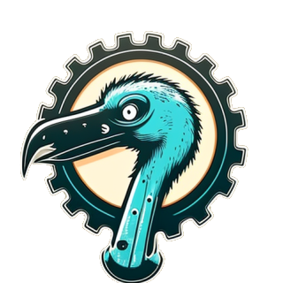
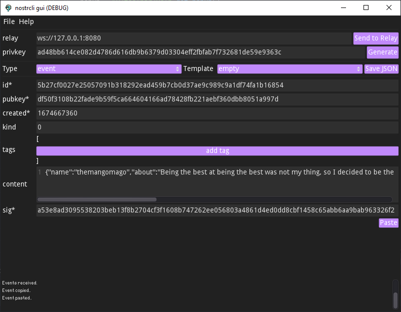

NOSTRCLI GUI
===========

This is a GUI for the [nostrcli tool](https://github.com/themangomago/nostr-cli). It is a simple tool to grab and push events from a relay. It's main purpose is for development and testing. But it can also be used to push custom events to a relay.

## Installation
There are no pre-builds yet as we are still in development. But you can build it yourself.

### Requirements
Godot 3.5+

### Build
Clone the repository and open the project in Godot. Then export it to your platform of choice.

## Usage

### Nostrcli
You need to have the [nostrcli tool](https://github.com/themangomago/nostr-cli) installed and in your path or in the same directory. 

### Grabbing events
To grab events from a relay, you need to enter the relay's address and the port. Change the type to request, add your desired filtes and click on the 'Send to Relay' button.
The results will be displayed in the window below. Also all results will be stored in the 'results.json' file.

### Pushing events
To push an event to a relay, you can use templates, write your own events or copy from requested events to clone events.

## License
This project is licensed under the MIT License - see the [LICENSE](LICENSE) file for details
